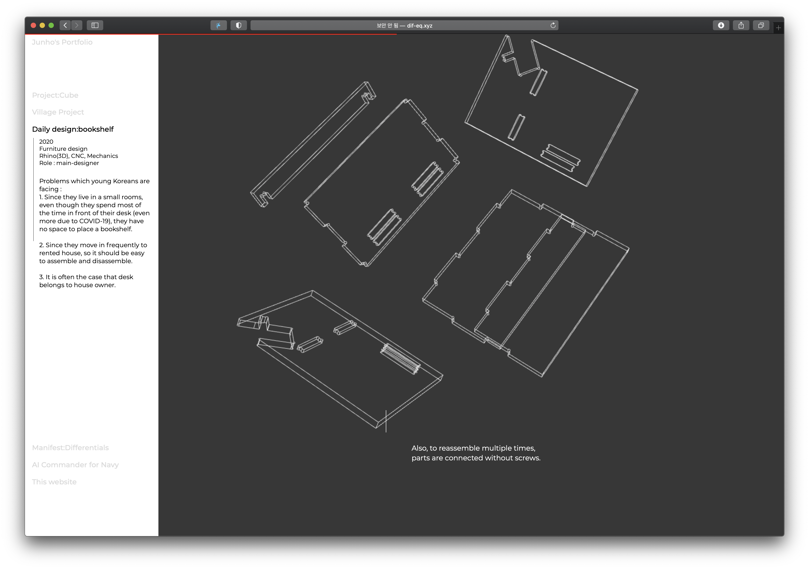

# Vanilla_javascript_portfolio
Explore how far I can go with vanilla Javascript

The key part is which shows exploded view of the bookshelf. 
To make it compact and light, I placed the image corresponds to Window.scrollY instead of a playback.  

You can click the image below to visit the website. 

